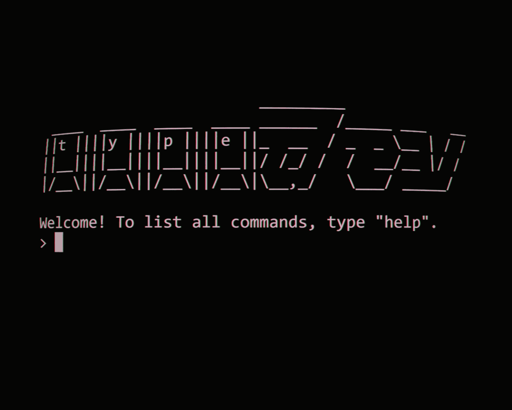

# typedev

### Spielprinzip

Spieler treten gegeneinander in einem Wettrennen des tippens an. Ab Start der Runde muss der anzeigte Text fehler frei eingetippt werden. Der Schnellste tipper gewinnt. Die Besonderheit: bei dem Text handelt es sich um Code-Snippets mit all ihren Klammern, Kommata und verrückten Syntax. Sobald der Sieger feststeht ist die Runde vorbei.

### Score System

Es gibt zwei Scores:

 - Wörter pro Minute
 
 - anzahl gewonnener Runden
 
Für beide gibt es je eine Topliste

### Login

ein Login ist geplant, um das Score system persistent zu gestalten und persönliche bestleistungen zu scpeichern.

### Code Source Files:
GO Language: https://github.com/docker/cli/blob/master/cli/cobra.go
LUA Script: https://pastebin.com/cUzGFJyw
C: https://github.com/torvalds/linux/blob/master/arch/arm64/kernel/syscall.c
Rust: https://github.com/starship/starship/blob/master/src/main.rs
zsh: https://github.com/denysdovhan/spaceship-prompt/blob/master/spaceship.zsh
Java:
C++:
C#:
Bash:
JavaScript: einfach unseren eigenen JavaScript code lul ich will company leaks in unserem Spiel
